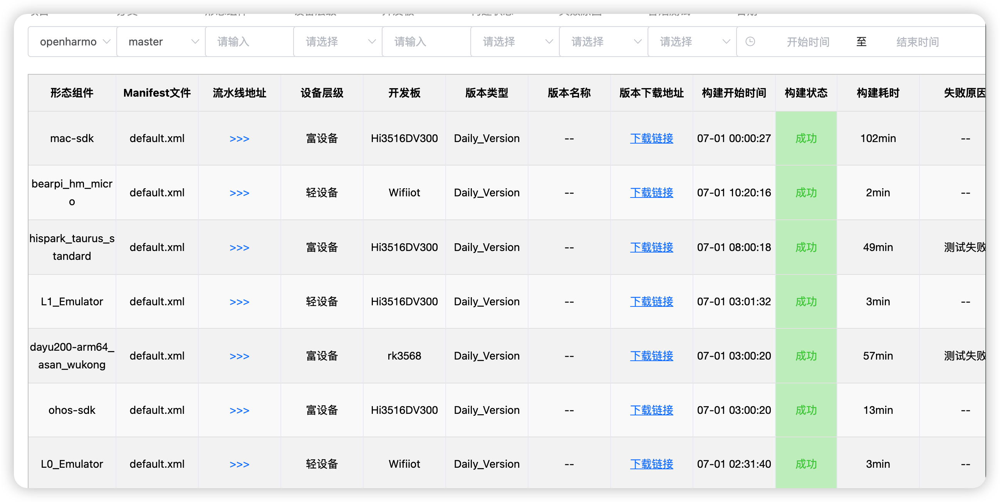
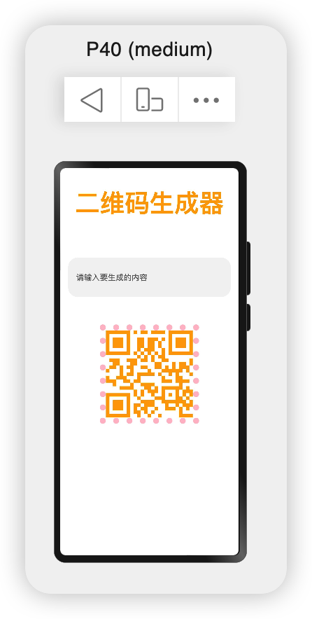
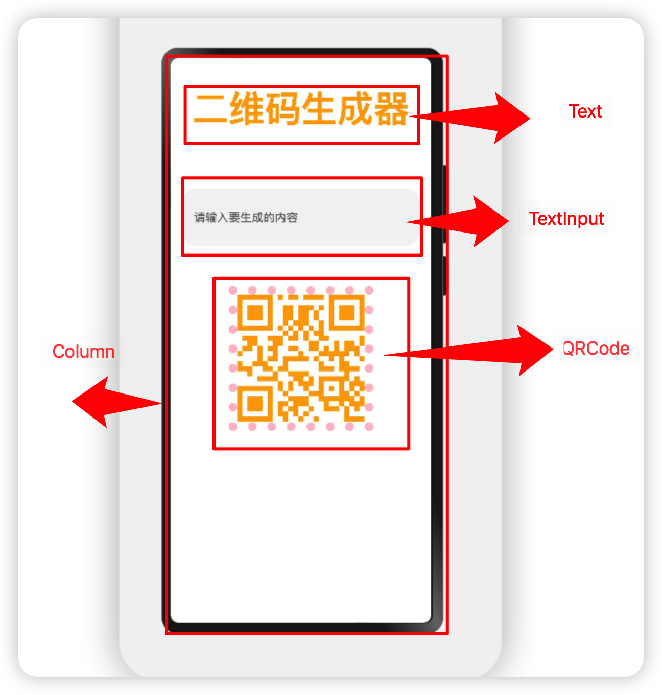
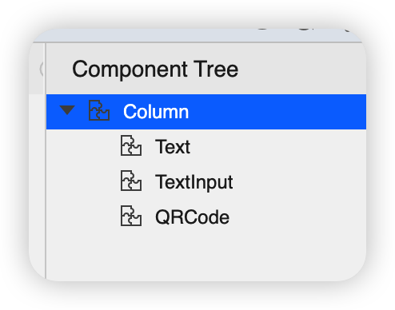
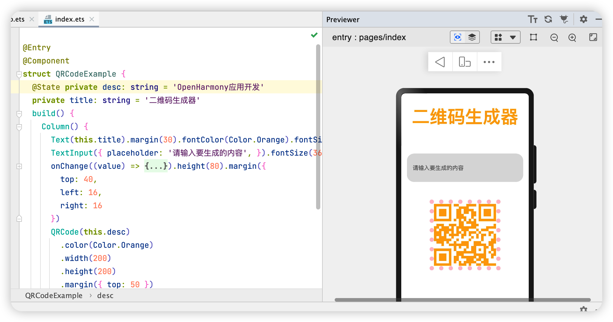

# OpenHarmony应用开发之二维码生成器

# QR code generator

本文展示了在DuYU200开发板上使用二维码QRCode组件，以及TextInput等组件，实现了根据输入内容实时生成二维码。

实现效果如下：


## 应用场景：

- 社交、移动支付等涉及到方便利用二维码传播信息的场景。

如今，随处可见的二维码，极大的方便了消费者，无论是进行移动支付还是和他人结成社交关系，都是可以通过二维码进行的。甚至有人会将自己的个人简历、以及个人名片制作成为二维码的形式，需要了解的人可以自行扫描二维码，了解详情。在进行消息传送的时候也会更加的方便。那么在鸿蒙开发中如何利用现有组件实现类似的二维码生成效果，本文就带大家了解。

## 相关概念

容器组件

- [Column](https://gitee.com/openharmony/docs/blob/master/zh-cn/application-dev/reference/arkui-ts/ts-container-column.md)

基础组件

- [Text](https://gitee.com/openharmony/docs/blob/master/zh-cn/application-dev/reference/arkui-ts/ts-basic-components-text.md)

- [TextInput](https://gitee.com/openharmony/docs/blob/master/zh-cn/application-dev/reference/arkui-ts/ts-basic-components-textinput.md)

- [QRCode](https://gitee.com/openharmony/docs/blob/master/zh-cn/application-dev/reference/arkui-ts/ts-basic-components-qrcode.md)

通用属性

- [边框设置](https://gitee.com/openharmony/docs/blob/master/zh-cn/application-dev/reference/arkui-ts/ts-universal-attributes-border.md)
- [尺寸设置](https://gitee.com/openharmony/docs/blob/master/zh-cn/application-dev/reference/arkui-ts/ts-universal-attributes-size.md)

[TS语法糖](https://gitee.com/openharmony/docs/blob/master/zh-cn/application-dev/ui/ts-syntactic-sugar.md)

## 搭建OpenHarmony环境

完成本篇Codelab我们首先要完成开发环境的搭建，本示例以**DAYU200**开发板为例，参照以下步骤进行：

1. [获取OpenHarmony系统版本](https://gitee.com/openharmony/docs/blob/master/zh-cn/device-dev/get-code/sourcecode-acquire.md#获取方式3从镜像站点获取)：标准系统解决方案（二进制）

   以3.0版本为例：

   烧录固件下载从每日构建下载：http://ci.openharmony.cn/dailys/dailybuilds

   

   

2. 搭建烧录环境

   1. [完成DevEco Device Tool的安装](https://gitee.com/openharmony/docs/blob/master/zh-cn/device-dev/quick-start/quickstart-standard-env-setup.md)
   2. [ HiHope-DAYU200烧录指导](https://gitee.com/hihope_iot/docs/tree/master/HiHope_DAYU200/%E7%83%A7%E5%86%99%E5%B7%A5%E5%85%B7%E5%8F%8A%E6%8C%87%E5%8D%97#https://gitee.com/hihope_iot/docs/blob/master/HiHope_DAYU200/%E7%83%A7%E5%86%99%E5%B7%A5%E5%85%B7%E5%8F%8A%E6%8C%87%E5%8D%97/HiHope-DAYU200%E9%95%9C%E5%83%8F%E7%83%A7%E5%BD%95%E6%8C%87%E5%8D%97.pdf)

3. 搭建开发环境

   1. 开始前请参考[工具准备](https://gitee.com/openharmony/docs/blob/master/zh-cn/application-dev/quick-start/start-overview.md#工具准备)，完成DevEco Studio的安装和开发环境配置。
   2. 开发环境配置完成后，请参考[使用工程向导](https://gitee.com/openharmony/docs/blob/master/zh-cn/application-dev/quick-start/start-with-ets.md#创建ets工程)创建工程（模板选择“Empty Ability”），选择JS或者eTS语言开发。
   3. 工程创建完成后，选择使用[真机进行调测](https://gitee.com/openharmony/docs/blob/master/zh-cn/application-dev/quick-start/start-with-ets.md#使用真机运行应用)。

## 开发教学

### 创建好的 eTS工程目录

新建工程的ETS目录如下图所示。


**各个文件夹和文件的作用：**

- **index.ets**：用于描述UI布局、样式、事件交互和页面逻辑。
- **app.ets**：用于全局应用逻辑和应用生命周期管理。
- **pages**：用于存放所有组件页面。
- **resources**：用于存放资源配置文件。

接下来开始正文。

我们的主要操作都是在在app.ets文件中，然后我将用不到10分钟的时间，带大家实现这个功能。

在开始之前大家可以先预览一下我要实现的界面效果，如下图所示：




我们可以分析一下界面布局，并进行一个简单的拆解：

### 拆解



根据设计图，可以看出整体是分行展示的，因此最外层是一个Column元素

- 第一行为标题，用Text就可以；

- 第二行是一个输入框，用TextInput就可以；

- 第三行是一个二维码，用QRCode就可以；


每一行之间的间隔，则可以考虑用通用属性中的尺寸设置来操作。

通过上面这样一步一步的分析后，基本上对大致的布局有了一个了解，最外层的控件大致选对（只要能实现的话，就是复杂度以及效率的问题），然后一步一步的拆解每一行的元素，如果有重复的或者觉得可以封装出来的部分，则进行下一步。

### 具体布局

具体布局设计到一些细节的地方，例如间隔，边框，当前组件尺寸设置等一些特殊情况，基本上就是嵌套，一层一层去实现。

运行效果图如下所示。


### 代码结构




### 编码

```js

@Entry
@Component
struct QRCodeExample {
  @State private content: string = 'OpenHarmony快速入门'
  private title: string = '二维码生成器'
  build() {
    Column({}) {
      Text(this.title).fontColor(Color.Orange).fontSize(50).fontWeight(FontWeight.Bold)
      TextInput({ placeholder: '请输入要生成的内容', }).fontSize(36).
      onChange((value) => {
        this.content = value;
      }).height(80).margin({left:20,right:20})
      QRCode(this.content)
        .color(Color.Orange)
        .width(200)
        .height(200)

        .border({
          width: 12, color: Color.Pink, style: BorderStyle.Dotted
        }).margin({bottom:60})
    }.width("100%").height("100%").justifyContent(FlexAlign.SpaceAround)
  }
}
```

我们用不到三十行代码实现这一功能，而且用到了语法糖，以及几个常见组件，可以让大家很好的预览OpenHarmony应用开发的基本流程。也是给刚入门的开发者一个启迪。




##  恭喜您


在本文中，我主要为大家讲解了如下ArkUI（基于TS扩展的类Web开发范式）基础组件

容器组件

- [Column](https://gitee.com/openharmony/docs/blob/master/zh-cn/application-dev/reference/arkui-ts/ts-container-column.md)

基础组件

- [Text](https://gitee.com/openharmony/docs/blob/master/zh-cn/application-dev/reference/arkui-ts/ts-basic-components-text.md)

- [TextInput](https://gitee.com/openharmony/docs/blob/master/zh-cn/application-dev/reference/arkui-ts/ts-basic-components-textinput.md)

- [QRCode](https://gitee.com/openharmony/docs/blob/master/zh-cn/application-dev/reference/arkui-ts/ts-basic-components-qrcode.md)

通用属性

- [边框设置](https://gitee.com/openharmony/docs/blob/master/zh-cn/application-dev/reference/arkui-ts/ts-universal-attributes-border.md)
- [尺寸设置](https://gitee.com/openharmony/docs/blob/master/zh-cn/application-dev/reference/arkui-ts/ts-universal-attributes-size.md)

通过一个代码示例，实现一个二维码生成器，希望通过本教程，各位开发者可以对以上基础组件具有更深刻的认识。

后面的计划：

- 二维码颜色可以通过弹窗自定义。
- 边框的属性可以通过弹窗自定义。

