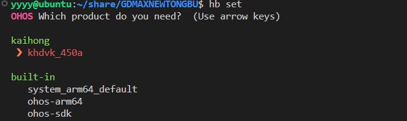
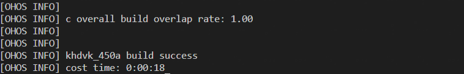
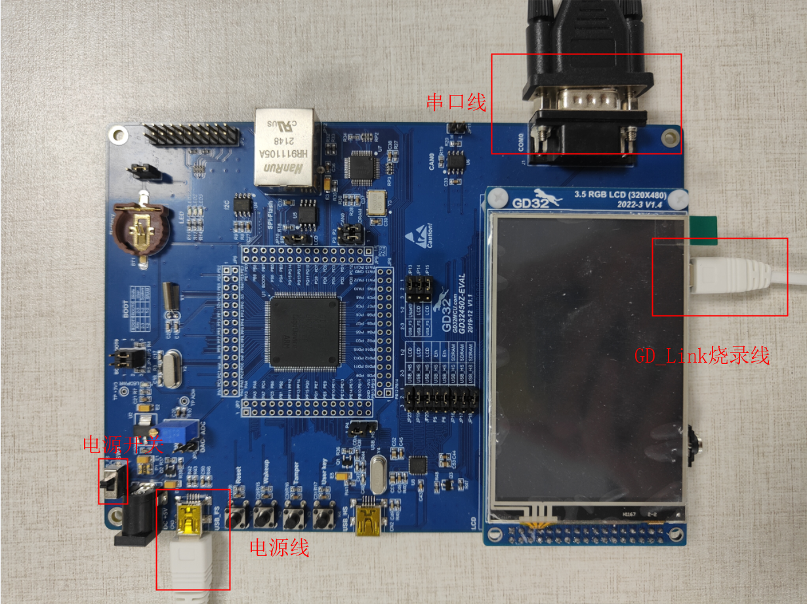
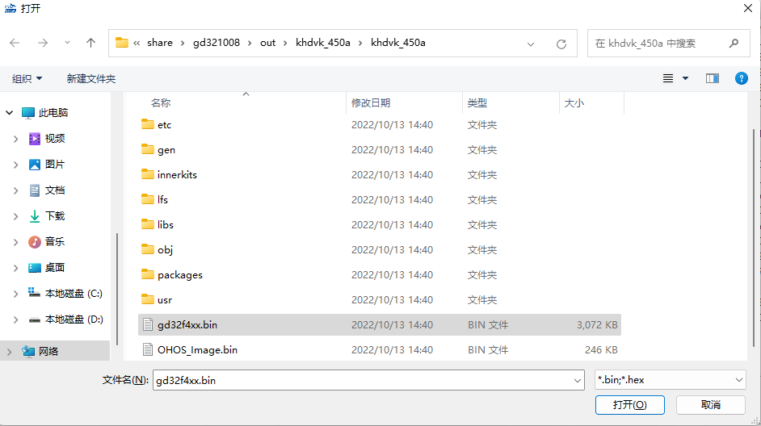
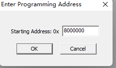
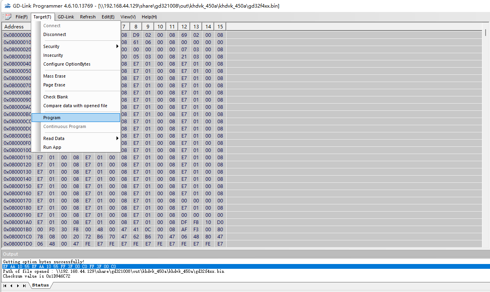
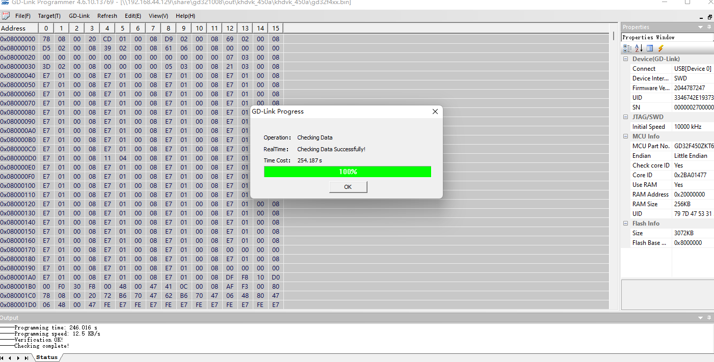
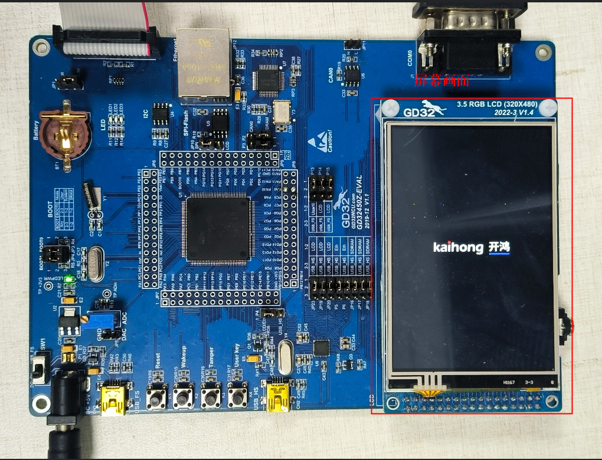
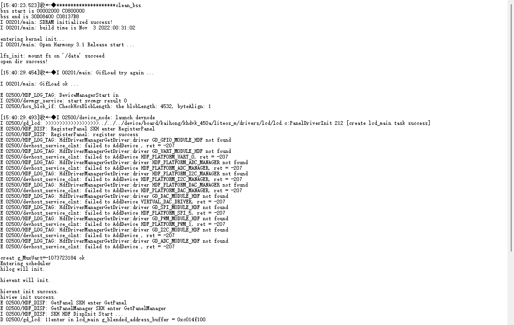

# KHDVK_450A产品实践指南

## 一、配置产品源码编译环境

### 1、安装依赖工具

安装命令如下：

```
sudo apt-get update && sudo apt-get install binutils binutils-dev flex bison build-essential zlib1g-dev gcc-multilib g++-multilib libc6-dev-amd64 lib32ncurses5-dev libx11-dev lib32z1-dev ccache unzip ruby zip make e2fsprogs liblz4-tool perl openssl libssl-dev libelf-dev libdwarf-dev u-boot-tools mtd-utils liblz4-tool gcc g++  libncurses5 apt-utils wget scons tar rsync git-core lib32z-dev quota libtinfo-dev libtinfo5 libncurses5-dev bc default-jdk libssl-dev libtinfo5 genext2fs 
```

说明：以上安装命令适用于Ubuntu 20.04，其它版本请根据安装包名称采用对应的安装命令。

### **2、安装交叉编译工具arm-none-eabi-gcc**

（1）Ubuntu自动安装arm-none-eabi-gcc

```
sudo apt-get install gcc-arm-none-eabi
```

（2）手动安装arm-none-eabi-gcc

  - [arm-none-eabi-gcc编译工具下载链接](https://developer.arm.com/-/media/Files/downloads/gnu-rm/10.3-2021.10/gcc-arm-none-eabi-10.3-2021.10-x86_64-linux.tar.bz2)

   解压gcc-arm-none-eabi-10.3-2021.10-x86_64-linux.tar.bz2安装包至~/toolchain/路径下。

```
mkdir -p ~/toolchain/
tar -jxvf gcc-arm-none-eabi-10.3-2021.10-x86_64-linux.tar.bz2 -C ~/toolchain/
```

(3) 设置环境变量

```
vim ~/.bashrc
```

将以下命令拷贝到.bashrc文件的末尾一行，保存并退出。

```
export PATH=~/toolchain/gcc-arm-none-eabi-10.3-2021.10/bin:$PATH
```

生效环境变量。

```
source ~/.bashrc
```

## 二、获取产品源码

### 1、前提条件

1）注册码云gitee账号。

2）注册码云SSH公钥，请参考[码云帮助中心](https://gitee.com/help/articles/4191)。

3）安装[git客户端](https://git-scm.com/book/zh/v2/%E8%B5%B7%E6%AD%A5-%E5%AE%89%E8%A3%85-Git)和[git-lfs](https://gitee.com/vcs-all-in-one/git-lfs?_from=gitee_search#downloading)并配置用户信息。

```
git config --global user.name "yourname"
git config --global user.email "your-email-address"
git config --global credential.helper store
```

4）安装码云repo工具，可以执行如下命令。

```
curl -s https://gitee.com/oschina/repo/raw/fork_flow/repo-py3 > /usr/local/bin/repo #如果没有权限，可下载至其它目录，并将其配置到环境变量中
chmod a+x /usr/local/bin/repo
pip3 install -i https://repo.huaweicloud.com/repository/pypi/simple requests
```

### 2、获取源码操作步骤

1）通过repo + ssh下载（需注册公钥，请参考码云帮助中心）。

```
repo init -u git@gitee.com:openharmony/manifest.git -b master --no-repo-verify
repo sync -c
repo forall -c 'git lfs pull'
```

2）通过repo + https下载。

```
repo init -u https://gitee.com/openharmony/manifest.git -b master --no-repo-verify
repo sync -c
repo forall -c 'git lfs pull'
```

### 3、执行prebuilts

在源码根目录下执行脚本，安装编译器及二进制工具。

```
bash build/prebuilts_download.sh
```

## 三、编译源码

在Linux环境进行如下操作：

1）进入源码根目录，执行如下命令进行版本编译。

```
hb set
```



选定`khdvk_450a`之后执行命令

```
hb build -f
```

如需进行XTS功能测试，则添加如下参数

```
hb build -f --gn-args="build_xts=true"
```

2）检查编译结果。编译完成后，log中显示如下：



编译所生成的文件都归档在`out/khdvk_450a/khdvk_450a`目录下。

3）编译源码完成，请进行镜像烧录。

## 四、镜像烧录

### 1、烧录前准备

1）如下图，连接电源线和烧录线。可自行选择是否连接串口线，打印错误日志。



2）下载GD-Link。

- [GD_Link参考下载链接](https://www.gd32mcu.com/data/documents/toolSoftware/GD_Link_Programmer_V4.6.10.13769.7z)

### 2、烧录流程

1）连接烧录线和电源线，打开GD-Link，点击connect连接开发板。


2）选择`\out\khdvk_450a\khdvk_450a`目录下的`gd32f4xx.bin`文件。



3）选择默认地址`8000000`，然后点击OK。



4）点击`Program`，即可开始烧录。



5）等待烧录完成。`gd32f4xx.bin`大小为3072KB，需要烧录约4分钟。



## 五、烧录成功显示

### 1、烧录成功LCD屏显示

烧录完成之后按下开发板reset按键，等待几秒，开机显示屏将亮起动画，如下所示：



### 2、烧录成功串口显示

使用USB转串口线连接开发板串口和电脑，然后在电脑上使用串口工具打开对应的串口号，按下开发板reset按键，等待几秒，串口显示打印信息如下：


